# SwiftMed — Korisnički priručnik (User Manual)

> **Verzija:** 1.0 · **Jezik:** Bosanski

---

## Sadržaj

1. [Pregled sistema](#1-pregled-sistema)
2. [Pokretanje aplikacije i navigacija](#2-pokretanje-aplikacije-i-navigacija)
3. [Registracija i prijava](#3-registracija-i-prijava)
4. [Pacijent — upravljanje rezervacijama](#4-pacijent--upravljanje-rezervacijama)
5. [Doktor — upravljanje terminima](#5-doktor--upravljanje-terminima)
6. [Medicinsko osoblje — panel osoblja](#6-medicinsko-osoblje--panel-osoblja)
7. [Administrator — admin panel](#7-administrator--admin-panel)
8. [Vlasnik — menadžment panel](#8-vlasnik--menadžment-panel)
9. [Profil korisnika](#9-profil-korisnika)
10. [Anonimna ocjena pregleda](#10-anonimna-ocjena-pregleda)
11. [Sigurnosne funkcionalnosti](#11-sigurnosne-funkcionalnosti)
12. [Chatbot asistent](#12-chatbot-asistent)
13. [Česta pitanja (FAQ)](#13-česta-pitanja-faq)

---

## 1. Pregled sistema

**SwiftMed** je web aplikacija za upravljanje bolničkim terminima i rezervacijama pregleda. Sistem podržava pet tipova korisnika, svaki s vlastitim skupom ovlaštenja i funkcionalnosti:

| Uloga | Opis | Početna stranica |
|---|---|---|
| **Pacijent** | Zakazivanje i praćenje pregleda | `/moje-rezervacije` |
| **Doktor** | Pregled i upravljanje terminom pacijenata | `/doktor-rezervacije` |
| **Medicinsko osoblje** | Pregled rasporeda i termina | `/osoblje-panel` |
| **Administrator** | Potpuno upravljanje sistemom | `/admin` |
| **Vlasnik** | Statistika i izvještaji | `/menadzment` |

---

## 2. Pokretanje aplikacije i navigacija

### Početna stranica

Početna stranica (`/`) dostupna je svim posjetiteljima bez prijave. Sadrži:
- **Kako funkcioniše** — opis procesa zakazivanja u koracima
- **Prednosti sistema** — ključne karakteristike platforme
- **Naši doktori** — prikaz dostupnih specijalista
- **Mapa lokacije** — karta ordinacije
- **Footer** — kontakt informacije i linkovi

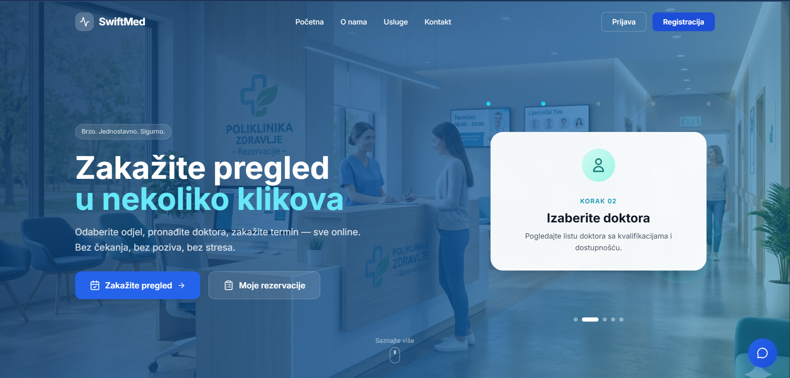

### Navigaciona traka (Navbar)

- **Logo SwiftMed** — klik vraća na početnu stranicu
- **Prijavite se** — vodi na stranicu za prijavu
- **Registrujte se** — vodi na stranicu za registraciju

Kada je korisnik prijavljen, navbar prikazuje ime korisnika i dugme za odjavu.

---

## 3. Registracija i prijava

### 3.1 Registracija novog naloga

> Dostupno na: `/registracija`

Registracija je namijenjena isključivo **pacijentima**. Ostale uloge (Doktor, Medicinsko osoblje, itd.) kreiraju administratori.

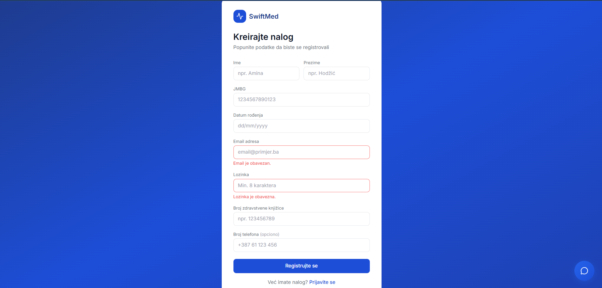

**Koraci registracije:**

1. Otvorite stranicu `/registracija` ili kliknite **"Registrujte se"** u navigaciji
2. Popunite obrazac sa sljedećim podacima:
   - **Ime** i **Prezime** — samo slova (uključujući bosančicu: Č, Ć, Š, Ž, Đ)
   - **JMBG** — tačno 13 cifara
   - **Datum rođenja** — može se unijeti ručno (DD/MM/YYYY) ili putem kalendara
   - **Email adresa** — mora biti validna i još nekorištena u sistemu
   - **Lozinka** — mora ispuniti sve zahtjeve:
     - Minimalno 8 karaktera
     - Barem jedno veliko slovo (A–Z)
     - Barem jedno malo slovo (a–z)
     - Barem jedna cifra (0–9)
     - Barem jedan specijalni karakter (npr. `!@#$%`)
   - **Broj zdravstvene knjižice** — obavezan
   - **Broj telefona** — opcionalan, format: `+387 6x xxx xxx` ili `06x xxx xxx`
3. Kliknite **"Registrujte se"**
4. Provjerite email — sistem šalje **6-cifreni verifikacioni kod** (vrijedi 15 minuta)
5. Unesite kod u prikazana polja (podržano copy-paste)
6. Po uspješnoj verifikaciji, bit ćete preusmjereni na prijavu

> **Napomena:** Ako niste primili kod, pričekajte 60 sekundi pa kliknite **"Pošalji ponovo"**.

---

### 3.2 Prijava u sistem

> Dostupno na: `/prijava`

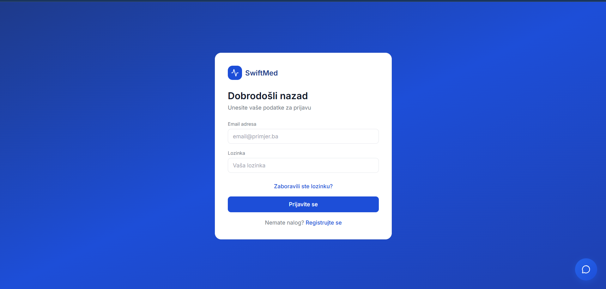

1. Unesite registrovanu **email adresu** i **lozinku**
2. Kliknite **"Prijavite se"**
3. Sistem vas automatski preusmjerava na odgovarajuću stranicu prema vašoj ulozi

**Mogući problemi:**
- `Email nije verifikovan` — provjerite inbox i verifikujte email
- `Pogrešan email ili lozinka` — provjerite podatke ili resetujte lozinku

---

### 3.3 Zaboravljena lozinka

**Na stranici prijave:**
1. Kliknite **"Zaboravili ste lozinku?"**
2. Unesite email adresu registrovanog naloga
3. Kliknite **"Pošalji link"**
4. Provjerite email — link za reset lozinke bit će poslan
5. Otvorite link iz emaila (`/reset-password`) i unesite novu lozinku

---

## 4. Pacijent — upravljanje rezervacijama

### 4.1 Pregled rezervacija

> Dostupno na: `/moje-rezervacije`

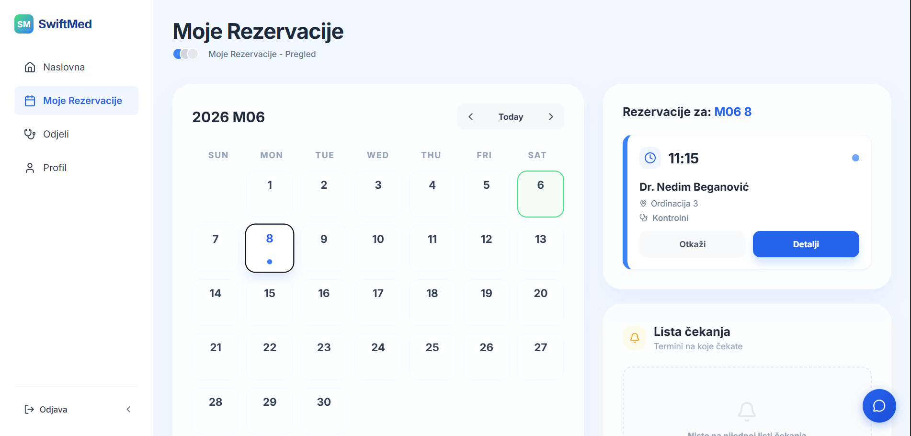

Nakon prijave pacijent vidi pregled svojih rezervacija s filterima i pretragom.

**Dostupne informacije za svaku rezervaciju:**
- Datum i vrijeme pregleda
- Ime doktora i odjel
- Tip pregleda (Opći pregled, Specijalistički, Kontrolni, Hitni)
- Status termina: **Zakazan** / **Potvrđen** / **Završen** / **Otkazan**

**Akcije dostupne pacijentu:**
- Pregled detalja rezervacije (dijagnoza, terapija, recept — ako je pregled završen)
- Otkazivanje rezervacije (moguće samo za buduće termine)
- Upload PDF dokumenta uz rezervaciju

---

### 4.2 Zakazivanje novog pregleda (5 koraka)

Zakazivanje pregleda odvija se kroz pet koraka:

#### Korak 1 — Odabir odjela (`/step1-odjeli`)

- Prikazuje se lista dostupnih odjela (Kardiologija, Neurologija, Pedijatrija, itd.)
- Kliknite na željeni odjel

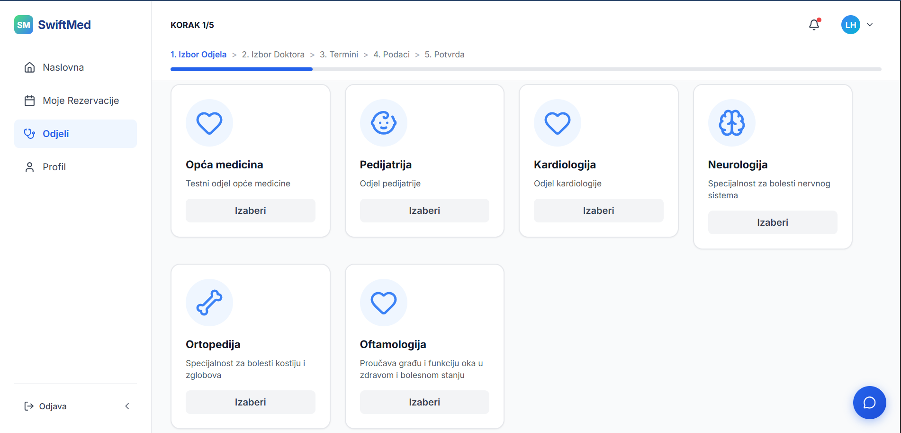

#### Korak 2 — Odabir doktora (`/step2-doktori`)

- Prikazuju se doktori odabranog odjela
- Za svakog doktora vidite: ime, specijalizaciju i prosječnu ocjenu pacijenata
- Kliknite na željenog doktora

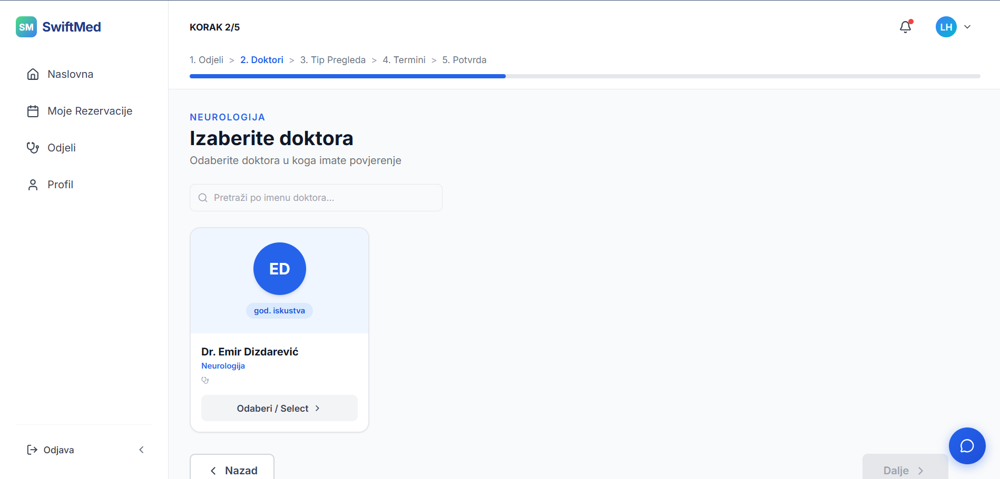

#### Korak 3 — Tip pregleda (`/step3-tip-pregleda`)

Dostupni tipovi:
| Tip | Opis |
|---|---|
| **Opći pregled** | Standardni pregled |
| **Specijalistički** | Specijalistički pregled |
| **Kontrolni** | Praćenje stanja |
| **Hitni** | Prioritetni termin |

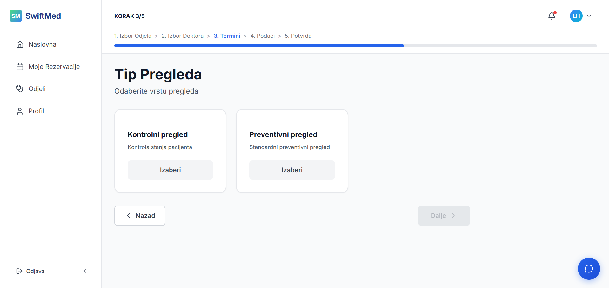

#### Korak 4 — Odabir termina (`/step4-termini`)

- Prikazuje se kalendar s dostupnim terminima
- Zeleni termini su slobodni, sivi su zauzeti
- Kliknite na slobodan termin da ga odaberete
- Sistem provjerava zauzetost u realnom vremenu

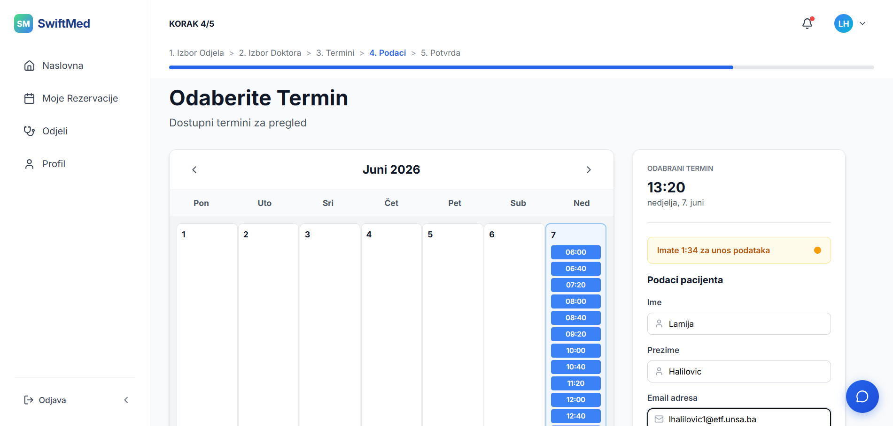

#### Korak 5 — Potvrda (`/step5-potvrda`)

- Pregled svih odabranih podataka (odjel, doktor, tip, datum, vrijeme)
- Opcionalno: dodajte komentar/napomenu
- Označite ako je hitno
- Kliknite **"Potvrdi rezervaciju"**
- Dobijate email potvrdu rezervacije

---

### 4.3 Otkazivanje rezervacije

1. Na stranici `Moje rezervacije` pronađite željenu rezervaciju
2. Kliknite na rezervaciju da otvorite detalje
3. Kliknite **"Otkaži termin"**
4. Potvrdite otkazivanje u dijaloškom okviru
5. Pacijent i doktor dobijaju email obavijest

---

### 4.4 Upload PDF dokumenta

Uz svaku rezervaciju možete priložiti PDF dokument (npr. uputnicu, nalaz):

1. Prilikom kreiranja rezervacije dolazite na korak 4 - Odabir termina
2. Kliknite **"Upload PDF"**
3. Odaberite PDF fajl s vašeg računara
4. Kliknite **"Učitaj"** — dokument je sada priložen terminu

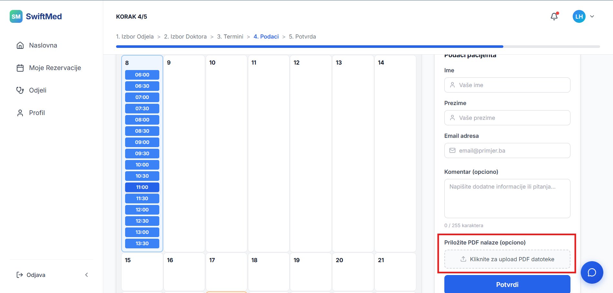

---

## 5. Doktor — upravljanje terminima

> Dostupno na: `/doktor-rezervacije`

### 5.1 Pregled termina

Doktor vidi kalendar sa svim terminima u tri načina prikaza:
- **Dnevni** — svi termini za odabrani dan
- **Sedmični** — pregled za tekuću sedmicu
- **Mjesečni** — pregled po danima u mjesecu

Za svaki termin vidljivi su:
- Ime i prezime pacijenta (+ starost)
- Tip pregleda
- Trajanje pregleda
- Status: **Zakazan** / **Potvrđen** / **Završen** / **Otkazan**

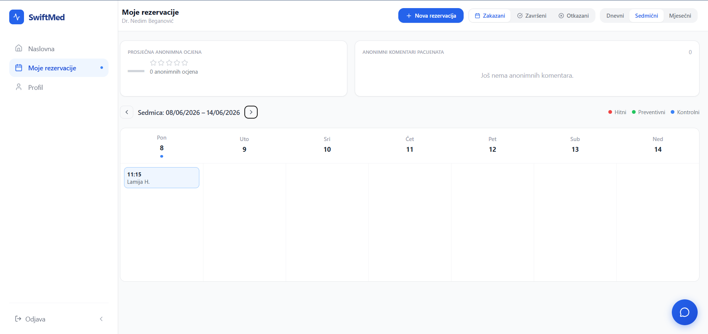

---

### 5.2 Detalji termina

Kliknite na termin da otvorite bočnu ploču s detaljima:
- Lični podaci pacijenta
- Medicinska historija (alergije, hronične bolesti, krvna grupa, prethodne operacije)
- Komentari i napomene uz rezervaciju
- Priloženi PDF dokumenti

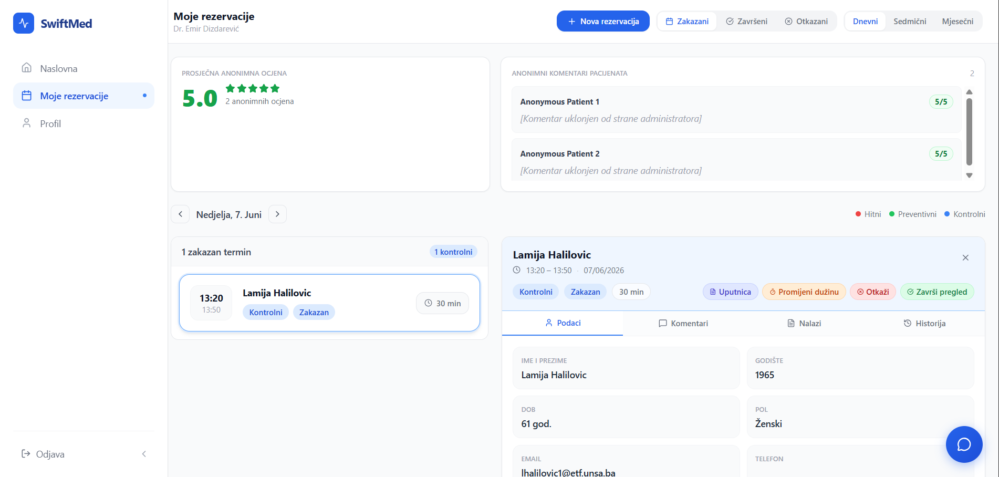

---

### 5.3 Završetak pregleda

1. U detaljima termina kliknite **"Završi pregled"**
2. Popunite obavezna polja:
   - **Dijagnoza** — opis dijagnoze
   - **Terapija** — preporučena terapija
   - **Bilješke** — opcionalne napomene
3. Opcionalno: dodajte recept klikom na **"Dodaj recept"**:
   - Naziv lijeka
   - Doza (npr. 1×1 tableta)
   - Trajanje u danima
   - Napomena (opcionalno)
4. Kliknite **"Završi pregled"** — podaci se čuvaju, pacijentu se šalje email s rezultatima

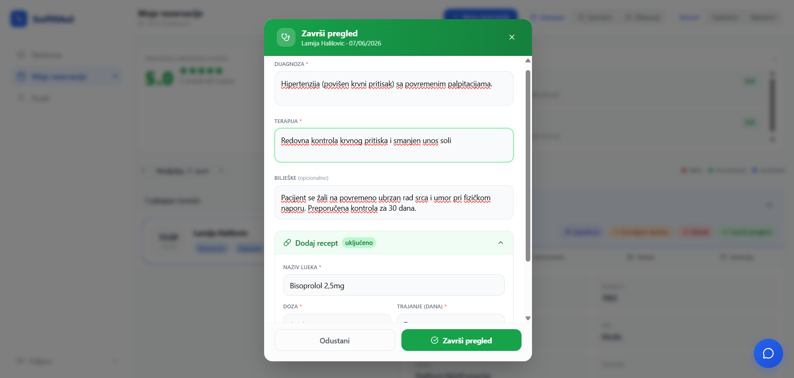

---

### 5.4 Kreiranje rezervacije za pacijenta

Doktor može zakazati termin u ime pacijenta:

1. Kliknite **"+ Nova rezervacija"** (gornji desni ugao)
2. Pretražite pacijenta po imenu ili emailu
3. Odaberite pacijenta
4. Pratite standardni proces zakazivanja (Koraci 1–5)

---

### 5.5 Otkazivanje ili pomjeranje termina

U detaljima termina:
- **Otkaži termin** — otvara dijalog s opcijama:
  - **Pomjeri na drugi termin** — odaberite slobodan termin iz kalendara; pacijent dobiva email obavijest
  - **Otkaži bez pomjeranja** — direktno otkazivanje; pacijent dobiva email obavijest

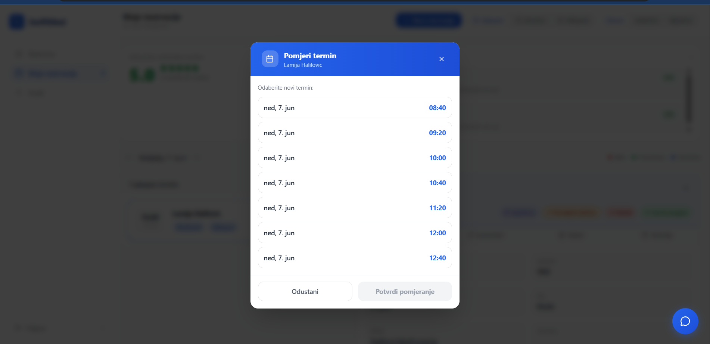

---

### 5.6 Zahtjev za promjenu trajanja termina

Ako je pregled složeniji i potrebno je više vremena:

1. U detaljima termina kliknite **"Promjena dužine"**
2. Odaberite željenu dužinu (10, 15, 20, 30, 45, ili 60 minuta)
3. Unesite razlog promjene (obavezno)
4. Kliknite **"Pošalji upit administratoru"**
5. Administrator prima zahtjev i donosi odluku

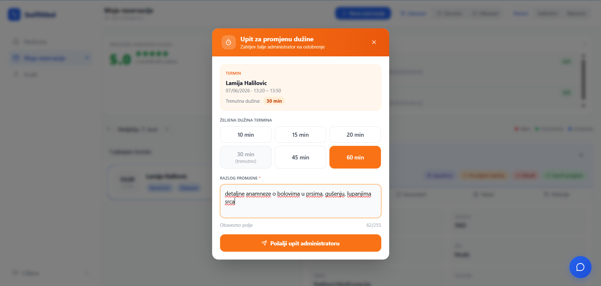

---

### 5.7 Recenzije pacijenata

Na dnu stranice doktor može vidjeti:
- Prosječnu ocjenu (1–5 zvjezdica)
- Broj primljenih recenzija
- Individualne komentare pacijenata (anonimni)

---

## 6. Medicinsko osoblje — panel osoblja

> Dostupno na: `/osoblje-panel`

Medicinsko osoblje (medicinske sestre, tehničari, itd.) ima pristup pregledu termina i rasporeda:

- Pregled svih termina u sistemu
- Pregled zauzetosti kabineta i sala
- Praćenje rasporeda doktora

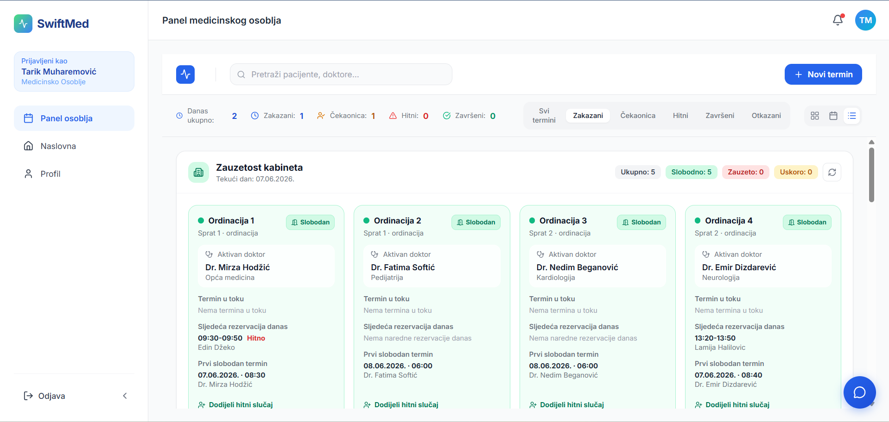

> **Napomena:** Medicinsko osoblje nema pravo mijenjati ili kreirati termine. Ova uloga je namijenjena pasivnom praćenju.

---

## 7. Administrator — admin panel

> Dostupno na: `/admin`

Administrator ima potpunu kontrolu nad sistemom putem tabova u admin panelu:

### Tab: Korisnici

Pregled, pretraga i upravljanje svim korisnicima:

| Funkcija | Opis |
|---|---|
| **Pretraga** | Pretraga po imenu ili emailu |
| **Filter po ulozi** | Administrator, Pacijent, Doktor, Med. osoblje, Vlasnik |
| **Filter po statusu** | Blokirani / Aktivni nalozi |
| **Detalji korisnika** | Kliknite "Detalji" za prikaz svih podataka |
| **Uredi korisnika** | Izmjena osnovnih podataka, medicinskog profila (za pacijente), podataka o doktoru ili osoblju |
| **Promjena uloge** | Promjena uloge korisnika (npr. Pacijent → Doktor); za Doktora potrebni: specijalizacija, broj licence, odjel |
| **Blokiranje naloga** | Privremena blokada pristupa; korisnik ne može da se prijavi |
| **Odblokiranje naloga** | Ponovna aktivacija blokiranog naloga |
| **Brisanje korisnika** | Trajno brisanje (nepovratna akcija!) |
| **Bulk akcije** | Označite više korisnika i blokirajte/odblokirajte/obrišite ih odjednom |

> ⚠️ **Upozorenje:** Administrator ne može blokirati, mijenjati ulogu niti brisati vlastiti nalog (označen oznakom "vi").

---

### Tab: Raspored

Prikaz i upravljanje rasporedima doktora:
- Kanban prikaz po danima u sedmici
- Dodavanje, izmjena i brisanje vremenskih slotova
- Upravljanje izuzecima (slobodni dani, bolovanje, itd.)

Prikaz rasporeda medicinskog osoblja (zasebna sekcija):
- Pregled smjena po danima i odjelima

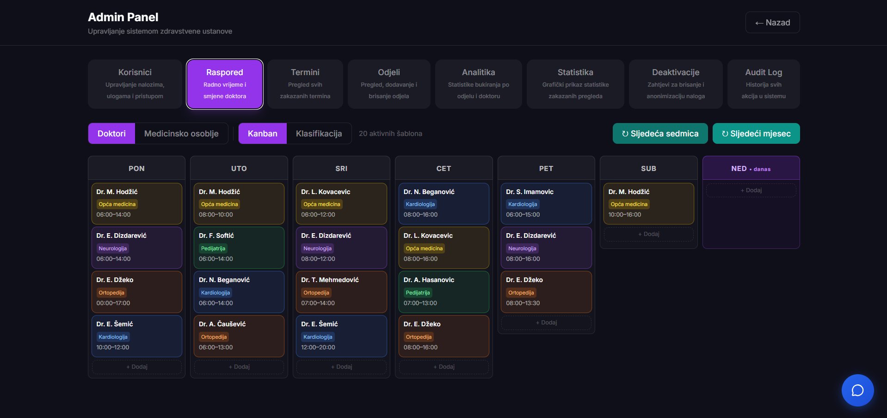

---

### Tab: Termini

Pregled svih termina u sistemu:
- Filtriranje po statusu (SLOBODAN, ZAKAZAN, POTVRĐEN, OTKAZAN)
- Pretraga po datumu i doktoru
- Pregled detalja rezervacija

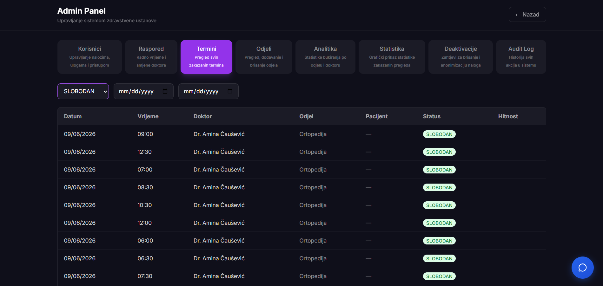

---

### Tab: Odjeli

Upravljanje odjelima zdravstvene ustanove:
- Pregled svih odjela s opisima
- Dodavanje novog odjela
- Pregled doktora i osoblja po odjelu
- Brisanje odjela

---

### Tab: Analitika

Statistički pregled rada sistema:
- **Broj termina danas** / sedmično / mjesečno
- **Otkazani termini** — procenat otkazivanja
- **Propušteni termini** — pacijenti koji se nisu pojavili
- **Prosječno čekanje** — prosječno vrijeme čekanja
- **Analitika po odjelu** — slobodni/zakazani/otkazani po odjelu
- **Analitika po doktoru** — opterećenost svakog doktora

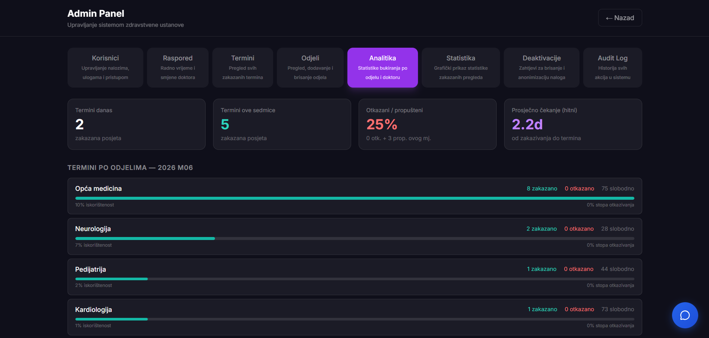

---

### Tab: Statistika

Grafički prikaz ključnih metrika (Charts/Dashboard):
- Vizuelni pregled zakazanih pregleda po periodima
- Grafovi trendova i raspoređenosti

---

### Tab: Deaktivacije

Upravljanje zahtjevima za deaktivaciju/anonimizaciju naloga:
- Lista zahtjeva pacijenata za brisanje naloga
- Status: **Na čekanju** / **Odobreno** / **Odbijeno**
- Odobravanje zahtjeva: podaci se anonimiziraju, aktivni termini se otkazuju
- Odbijanje zahtjeva: unesite obrazloženje koje se šalje pacijentu

---

### Tab: Audit Log

Historija svih akcija u sistemu:
- Ko je, kada i šta uradio (prijava, kreiranje, brisanje, izmjena)
- Pretraga i filtriranje po datumu, korisniku i tipu akcije
- Neophodano za sigurnosni nadzor i reviziju

---

## 8. Vlasnik — menadžment panel

> Dostupno na: `/menadzment`

Vlasnik/menadžment ima pristup analitičkim i izvještajnim podacima:

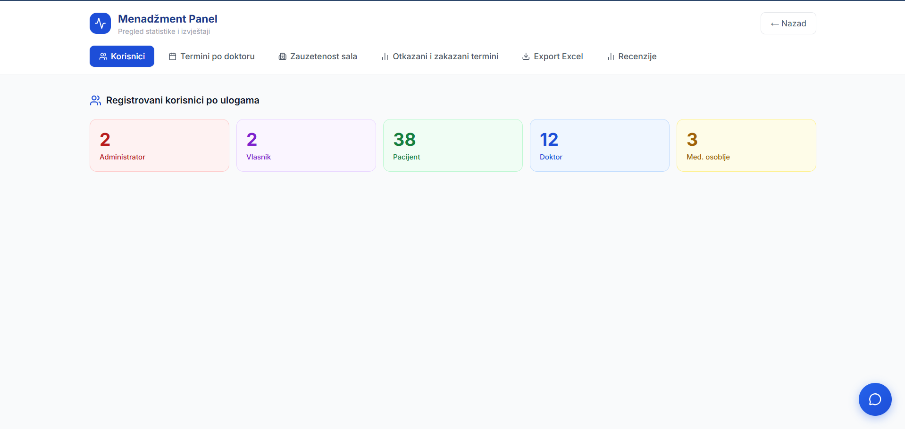

### Tab: Korisnici

Statistički pregled broja registrovanih korisnika po ulogama (kartice s brojevima).

---

### Tab: Termini po doktoru

Tabela zauzetosti termina po svakom doktoru:
- Ukupan broj termina, zakazanih i slobodnih
- Procenat iskorištenosti (progress bar + postotak)
- Vizualni indikator opterećenosti (zeleno < 50%, žuto 50–80%, crveno > 80%)

---

### Tab: Zauzetenost sala

Pregled svih prostorija zdravstvene ustanove:

| Kolona | Opis |
|---|---|
| Soba | Naziv i kapacitet |
| Tip | ORDINACIJA / SALA / KABINET / LABORATORIJ |
| Sprat | Prizemlje ili broj sprata |
| Status | Aktivna / Neaktivna / U renovaciji |
| Doktori | Ko koristi tu sobu |
| Ukupno rezervacija | Sveukupno (otkazane + zakazane + završene) |
| Aktivnih | Trenutno zakazani termini |
| Završenih | Uspješno obavljeni pregledi |
| Otkazanih | Otkazani termini |

---

### Tab: Otkazani i zakazani termini

Detaljan log svih termina s filterima:

**Filteri:**
- Status: Svi / Zakazani / Otkazani / Slobodni
- Datum od — Datum do

**Podaci u tabeli:**
- Status termina (vizuelni badge)
- Datum i vrijeme (UTC)
- Doktor i odjel/soba
- Ko je zakazao i kada
- Ko je otkazao i kada (ako je otkazan)

Navigacija: straničenje (20 termina po stranici).

---

### Tab: Export Excel

Generisanje Excel izvještaja za odabrani period:

1. Odaberite **Datum od** i **Datum do**
2. Kliknite **"Generiši Excel"**
3. Fajl se automatski preuzima u formatu `.xlsx`
4. Naziv fajla: `statistika_YYYY-MM-DD_YYYY-MM-DD.xlsx`

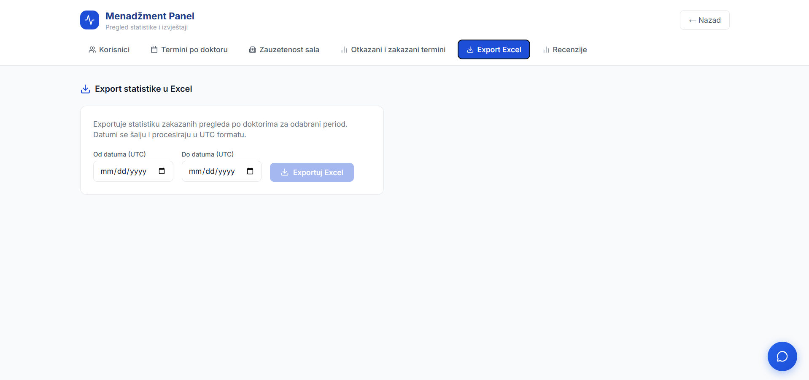

---

### Tab: Recenzije

Pregled svih recenzija pacijenata:
- Ocjena (1–5 zvjezdica) i komentar
- Informacije o doktoru i odjelu
- Datum slanja recenzije
- Mogućnost **sakrivanja komentara** (ocjena ostaje vidljiva, ali komentar se skriva)
- Filter: Samo recenzije s komentarom

---

## 9. Profil korisnika

> Dostupno na: `/profil`

Svaki prijavljeni korisnik može pristupiti vlastitom profilu.

### Uređivanje profila

Kliknite **"Uredi profil"** (gornji desni ugao):
- Izmjena **Imena** i **Prezimena**
- Izmjena **Broja telefona**
- Izmjena **Datuma rođenja**
- **Email adresa nije promjenjiva** (prikazana je kao zaključano polje)

Kliknite **"Sačuvaj izmjene"** za čuvanje.

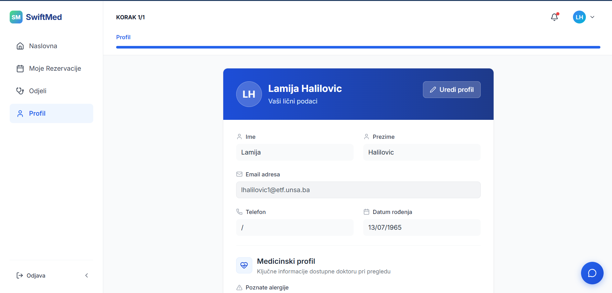

---

### Medicinski profil (samo za pacijente)

Pacijenti imaju dodatnu sekciju s medicinskim podacima dostupnim doktoru pri pregledu:

| Polje | Opis |
|---|---|
| Poznate alergije | Navođenje alergija (penicilin, polen, itd.) |
| Hronične bolesti | Dijabetes, astma, hipertenzija, itd. |
| Krvna grupa | Odabir iz liste (A+, A−, B+, B−, AB+, AB−, O+, O−) |
| Doniranje krvi | Da / Ne (checkbox) |
| Prethodne operacije | Da / Ne; ako Da — opis i godina |

---

### Privatnost i deaktivacija naloga (samo pacijenti)

Pacijenti mogu zatražiti trajnu deaktivaciju i anonimizaciju svog naloga:

1. Kliknite **"Zatraži deaktivaciju naloga"**
2. Opcionalno navedite razlog
3. Kliknite **"Potvrdi zahtjev"**

**Šta se dešava pri odobrenom zahtjevu:**
- Lični podaci (ime, email, telefon, JMBG) se anonimiziraju
- Aktivni termini se otkazuju
- Pristup nalogu postaje nemoguć
- Medicinski podaci ostaju u anonimiziranoj formi (zakonska obaveza)

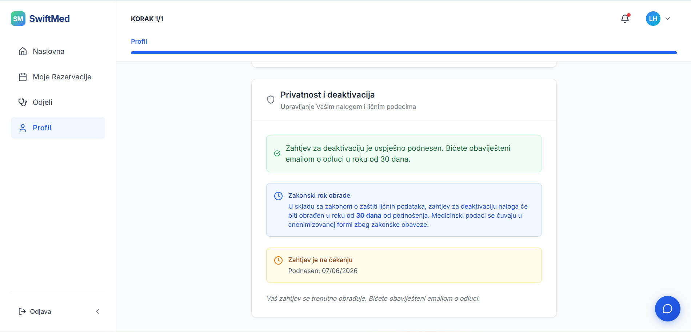

> **Napomena:** Zahtjev se obrađuje u roku od 30 dana. Status možete pratiti na stranici profila.

---

## 10. Anonimna ocjena pregleda

> Dostupno na: `/anonimna-ocjena?token=...`

Nakon završenog pregleda, pacijent prima email s jedinstvenim linkom za anonimnu ocjenu.

**Proces ocjenjivanja:**

1. Otvorite link iz emaila
2. Pregledajte informacije o pregledu (doktor, datum, vrijeme)
3. Odaberite **ocjenu od 1 do 5 zvjezdica** (obavezno)
4. Opcionalno unesite **komentar** (maksimalno 500 karaktera)
5. Kliknite **"Pošalji anonimnu ocjenu"**

> **Privatnost:** Doktor ne vidi vaše ime, email niti identifikacione podatke. Ocjena je potpuno anonimna.

**Važne napomene:**
- Svaki link može biti iskorišten samo jednom
- Link je validan samo za završene preglede
- Ako je pregled otkazan ili link istekao, ocjenjivanje nije moguće

---

## 11. Sigurnosne funkcionalnosti

### 11.1 Automatska odjava (Auto-Logout)

Iz sigurnosnih razloga, sistem automatski odjavljuje korisnika nakon perioda neaktivnosti.

**Tok:**
1. Kada se sesija bliži isteku, prikazuje se modalni prozor s upozorenjem
2. **"Produži sesiju"** — kliknite da ostanete prijavljeni; timer se resetuje
3. **"Odjavi se"** — kliknite za trenutnu odjavu
4. Ako ne reagujete, bit ćete automatski odjavljeni

### 11.2 Blokiranje naloga

Administratori mogu blokirati nalog koji narušava pravila. Blokirani korisnik:
- Ne može se prijaviti
- Pri pokušaju prijave vidi poruku o blokiranom nalogu
- Za odblokiranje kontaktira administratora

### 11.3 Višestruki neuspješni pokušaji prijave

Sistem prati broj neuspješnih pokušaja prijave. Nakon određenog broja neuspjelih pokušaja, nalog se automatski zaključava radi zaštite od neautorizovanog pristupa.

### 11.4 Verifikacija emaila

Svaki novi nalog mora proći verifikaciju emaila. Bez verifikacije prijava nije moguća. Verifikacioni kod vrijedi 15 minuta.

---

## 12. Chatbot asistent

Na svim stranicama dostupan je **SwiftMed Chatbot** (ikona u donjem desnom uglu).

- Kliknite na ikonu za otvaranje chata
- Postavite pitanje o korištenju sistema, terminima ili uslugama
- Chatbot pruža automatske odgovore i uputstva

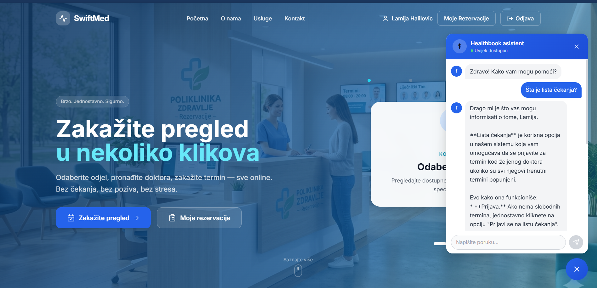

---

## 13. Česta pitanja (FAQ)

**P: Mogu li otkazati termin?**
O: Da, ali samo za buduće termine. Idite na `Moje rezervacije`, otvorite termin i kliknite "Otkaži termin". I vi i doktor dobijate email potvrdu.

**P: Zaboravio/la sam lozinku — šta da radim?**
O: Na stranici prijave kliknite "Zaboravili ste lozinku?", unesite email i pratite upute u emailu koji ćete primiti.

**P: Nisam primio/la verifikacioni kod?**
O: Provjerite spam/junk folder. Ako ne nađete email, pričekajte 60 sekundi i kliknite "Pošalji ponovo" na stranici verifikacije.

**P: Kako doktor vidi moje medicinske podatke?**
O: Doktor vidi medicinski profil koji ste sami unijeli (alergije, hronične bolesti, krvna grupa). Ti podaci su dostupni samo doktoru koji pregledava vaš termin.

**P: Kako funkcioniše anonimna ocjena?**
O: Nakon pregleda primate email s jedinstvenim linkom. Ocjena je potpuno anonimna — doktor ne zna ko je ocjenu ostavio.

**P: Mogu li imati više aktivnih rezervacija?**
O: Da, možete imati više aktivnih rezervacija kod različitih doktora u isto vrijeme.

**P: Šta se dešava ako doktor otkaže moj termin?**
O: Primate email obavijest. Doktor može ponuditi alternativni termin ili samo otkazati. U oba slučaja informacija stiže emailom.

**P: Koliko dugo se čuva historija pregleda?**
O: Historija pregleda (dijagnoza, terapija, recepti) čuva se trajno i dostupna vam je u sekciji `Moje rezervacije`.

**P: Mogu li zakazati pregled za drugu osobu?**
O: Pacijenti mogu zakazati samo za sebe. Doktor može zakazati termin u ime bilo kojeg pacijenta registrovanog u sistemu.

---

*SwiftMed — Bolnički informacioni sistem*
*Za tehničku podršku, kontaktirajte administratora sistema.*
