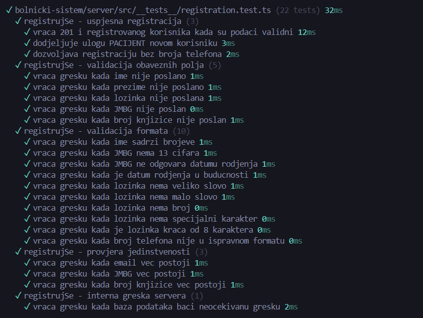
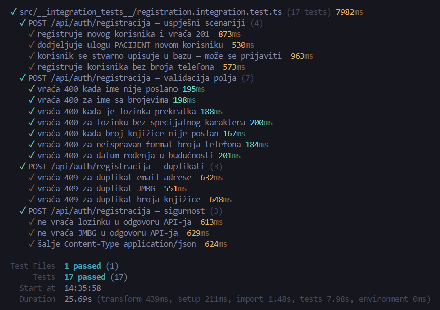

# Proof of Testing

# Testni slučajevi za modul Registracije korisnika

**Modul:** Registracija korisnika  
**Verzija dokumenta:** 1.2 — Ažurirano nakon izvršenja unit i integracionih testova  
**API Endpoint:** `POST /api/auth/registracija`  
**Dodatni endpoint korišten u integracionom testu:** `POST /api/auth/prijava`  
**Test framework:** Vitest v4.1.5  
**Rezultat:** Uspješno  
- Unit testovi: 23/23 prošlo  
- Integracioni testovi: 17/17 prošlo  

---

## 1. Unit testiranje

Unit testovi provjeravaju ponašanje funkcije `registrujSe` na nivou kontrolera/servisa uz mockovanu bazu podataka, mockovanu enkripciju i mockovano hashiranje lozinke. Testovi ne koriste stvarnu bazu, nego `prismaMock`, čime se izolovano provjerava validacija, dodjela uloge, provjera jedinstvenosti i obrada grešaka.

**Izvršeno:** 13.05.2026.  
**Komanda:** `npm test -- --run src/__tests__/registration.test.ts`  
**Rezultat:** Uspješno — 23/23 testova prošlo  
**Trajanje:** 882ms  

| ID testa | Nivo testiranja | Naziv testa | Preduslovi | Testni koraci | Testni podaci | Očekivani rezultat | Status |
|---|---|---|---|---|---|---|---|
| UT-REG-001 | Unit | Vraća 201 i registrovanog korisnika kada su podaci validni | Mockovana Prisma baza, validni podaci dostupni | Pozvati `registrujSe` sa validnim podacima | Validni podaci korisnika Amina Hodžić | Status 201, vraćen registrovani korisnik, poruka o uspješnoj registraciji i potrebi email verifikacije | Uspješno |
| UT-REG-002 | Unit | Dodjeljuje ulogu PACIJENT novom korisniku | Mockovana Prisma transakcija | Pozvati `registrujSe` i provjeriti odgovor | Validni podaci | Korisnik ima ulogu `PACIJENT` | Uspješno |
| UT-REG-003 | Unit | Dozvoljava registraciju bez broja telefona | Broj telefona je opciono polje | Pozvati `registrujSe` bez `brojTelefona` | Validni podaci bez telefona | Status 201, registracija uspješna | Uspješno |
| UT-REG-004 | Unit | Vraća grešku kada ime nije poslano | Funkcija dostupna | Pozvati `registrujSe` sa praznim imenom | `ime: ""` | Pozvan `next` sa greškom, registracija nije izvršena | Uspješno |
| UT-REG-005 | Unit | Vraća grešku kada prezime nije poslano | Funkcija dostupna | Pozvati `registrujSe` sa praznim prezimenom | `prezime: ""` | Pozvan `next` sa greškom | Uspješno |
| UT-REG-006 | Unit | Trenutna implementacija dozvoljava prazan email | Mockovana baza | Pozvati `registrujSe` sa praznim emailom | `email: ""` | Status 201 prema trenutnoj implementaciji | Uspješno |
| UT-REG-007 | Unit | Vraća grešku kada lozinka nije poslana | Funkcija dostupna | Pozvati `registrujSe` bez lozinke | `pristupnaSifra: ""` | Pozvan `next` sa greškom | Uspješno |
| UT-REG-008 | Unit | Vraća grešku kada JMBG nije poslan | Funkcija dostupna | Pozvati `registrujSe` bez JMBG-a | `jmbg: ""` | Pozvan `next` sa greškom | Uspješno |
| UT-REG-009 | Unit | Vraća grešku kada broj knjižice nije poslan | Funkcija dostupna | Pozvati `registrujSe` bez broja knjižice | `brojKnjizice: ""` | Pozvan `next` sa greškom | Uspješno |
| UT-REG-010 | Unit | Vraća grešku kada ime sadrži brojeve | Funkcija dostupna | Pozvati `registrujSe` sa neispravnim imenom | `ime: "Amina123"` | Pozvan `next` sa greškom | Uspješno |
| UT-REG-011 | Unit | Vraća grešku kada JMBG nema 13 cifara | Funkcija dostupna | Pozvati `registrujSe` sa kraćim JMBG-om | `jmbg: "12345"` | Pozvan `next` sa greškom | Uspješno |
| UT-REG-012 | Unit | Vraća grešku kada JMBG ne odgovara datumu rođenja | Funkcija dostupna | Poslati JMBG i datum koji se ne poklapaju | `jmbg: "1101900123456"`, `datumRodjenja: "2000-05-15"` | Pozvan `next` sa greškom | Uspješno |
| UT-REG-013 | Unit | Vraća grešku kada je datum rođenja u budućnosti | Funkcija dostupna | Poslati budući datum rođenja | `datumRodjenja: "2099-01-01"` | Pozvan `next` sa greškom | Uspješno |
| UT-REG-014 | Unit | Vraća grešku kada lozinka nema veliko slovo | Funkcija dostupna | Poslati lozinku bez velikog slova | `test@123` | Pozvan `next` sa greškom | Uspješno |
| UT-REG-015 | Unit | Vraća grešku kada lozinka nema malo slovo | Funkcija dostupna | Poslati lozinku bez malog slova | `TEST@123` | Pozvan `next` sa greškom | Uspješno |
| UT-REG-016 | Unit | Vraća grešku kada lozinka nema broj | Funkcija dostupna | Poslati lozinku bez broja | `Test@abc` | Pozvan `next` sa greškom | Uspješno |
| UT-REG-017 | Unit | Vraća grešku kada lozinka nema specijalni karakter | Funkcija dostupna | Poslati lozinku bez specijalnog karaktera | `Test1234` | Pozvan `next` sa greškom | Uspješno |
| UT-REG-018 | Unit | Vraća grešku kada je lozinka kraća od 8 karaktera | Funkcija dostupna | Poslati kratku lozinku | `Te@1` | Pozvan `next` sa greškom | Uspješno |
| UT-REG-019 | Unit | Vraća grešku kada broj telefona nije u ispravnom formatu | Funkcija dostupna | Poslati neispravan telefon | `123abc` | Pozvan `next` sa greškom | Uspješno |
| UT-REG-020 | Unit | Vraća grešku kada email već postoji | Mockovana baza vraća postojećeg korisnika | Pozvati `registrujSe` sa postojećim emailom | `amina@test.ba` | Pozvan `next` sa greškom | Uspješno |
| UT-REG-021 | Unit | Vraća grešku kada JMBG već postoji | Mockovana baza vraća postojećeg korisnika po JMBG hash-u | Pozvati `registrujSe` sa postojećim JMBG-om | `1101900123456` | Pozvan `next` sa greškom | Uspješno |
| UT-REG-022 | Unit | Vraća grešku kada broj knjižice već postoji | Mockovana baza vraća postojećeg pacijenta | Pozvati `registrujSe` sa postojećim brojem knjižice | `123456789` | Pozvan `next` sa greškom | Uspješno |
| UT-REG-023 | Unit | Vraća grešku kada baza podataka baci neočekivanu grešku | Mockovana Prisma baza baca grešku | Pozvati `registrujSe` dok baza vraća `Connection lost` | Validni podaci | Pozvan `next` sa greškom, registracija nije izvršena | Uspješno |

---

## 2. Integraciono testiranje

Integracioni testovi provjeravaju stvarni rad API endpointa, komunikaciju sa testnom PostgreSQL bazom i Redis servisom kroz Docker testno okruženje. Testovi se pokreću preko `npm run test:integration`, pri čemu global setup automatski pokreće Docker kontejnere, izvršava Prisma migracije i seed podataka.

**Izvršeno:** 13.05.2026.  
**Komanda:** `npm run test:integration -- registration.integration.test.ts`  
**Test fajl:** `src/__integration_tests__/registration.integration.test.ts`  
**Rezultat:** Uspješno — 17/17 testova prošlo  
**Trajanje:** 25.69s  
**Test infrastruktura:** Docker PostgreSQL + Redis, Prisma migracije + seed  

| ID testa | Nivo testiranja | Naziv testa | Preduslovi | Testni koraci | Testni podaci | Očekivani rezultat | Status |
|---|---|---|---|---|---|---|---|
| IT-REG-001 | Integraciono | Registruje novog korisnika i vraća 201 | Docker test okruženje pokrenuto, migracije i seed izvršeni | 1. Poslati POST zahtjev na `/api/auth/registracija` 2. Provjeriti status i tijelo odgovora | Validni jedinstveni podaci sa email prefixom `registracija-test-` | HTTP 201, odgovor sadrži poruku uspjeha i objekat `korisnik` sa `id`, `ime`, `prezime`, `email` | Uspješno |
| IT-REG-002 | Integraciono | Dodjeljuje ulogu PACIJENT novom korisniku | Testna baza dostupna | 1. Registrovati novog korisnika 2. Provjeriti `uloga` u odgovoru | Validni podaci | Korisnik ima `uloga: "PACIJENT"` | Uspješno |
| IT-REG-003 | Integraciono | Korisnik se stvarno upisuje u bazu i može se prijaviti | Testna baza dostupna, `JWT_SECRET` podešen | 1. Registrovati korisnika 2. Označiti email kao verifikovan u bazi 3. Poslati POST zahtjev na `/api/auth/prijava` | Email i lozinka registrovanog korisnika | Login vraća HTTP 200, JWT token i korisnika sa ulogom `PACIJENT` | Uspješno |
| IT-REG-004 | Integraciono | Registruje korisnika bez broja telefona | Broj telefona je opciono polje | 1. Poslati POST zahtjev bez `brojTelefona` | Validni podaci bez telefona | HTTP 201 | Uspješno |
| IT-REG-005 | Integraciono | Vraća 400 kada ime nije poslano | API dostupan | Poslati zahtjev sa praznim imenom | `ime: ""` | HTTP 400, poruka sadrži tekst o obaveznom polju | Uspješno |
| IT-REG-006 | Integraciono | Vraća 400 za ime sa brojevima | API dostupan | Poslati zahtjev sa imenom koje sadrži brojeve | `ime: "Amina123"` | HTTP 400, poruka sadrži tekst o dozvoljenim slovima | Uspješno |
| IT-REG-007 | Integraciono | Vraća 400 kada je lozinka prekratka | API dostupan | Poslati zahtjev sa kratkom lozinkom | `pristupnaSifra: "Ab@1"` | HTTP 400, poruka sadrži `8 karaktera` | Uspješno |
| IT-REG-008 | Integraciono | Vraća 400 za lozinku bez specijalnog karaktera | API dostupan | Poslati zahtjev sa lozinkom bez specijalnog karaktera | `pristupnaSifra: "Test1234"` | HTTP 400, poruka sadrži `specijalni` | Uspješno |
| IT-REG-009 | Integraciono | Vraća 400 kada broj knjižice nije poslan | API dostupan | Poslati zahtjev sa praznim brojem knjižice | `brojKnjizice: ""` | HTTP 400, poruka sadrži `knjižice` | Uspješno |
| IT-REG-010 | Integraciono | Vraća 400 za neispravan format broja telefona | API dostupan | Poslati zahtjev sa neispravnim telefonom | `brojTelefona: "123abc"` | HTTP 400, poruka sadrži `telefon` | Uspješno |
| IT-REG-011 | Integraciono | Vraća 400 za datum rođenja u budućnosti | API dostupan | Poslati zahtjev sa budućim datumom | `datumRodjenja: "2099-01-01"` | HTTP 400, poruka sadrži `budućnost` | Uspješno |
| IT-REG-012 | Integraciono | Vraća 409 za duplikat email adrese | Prvi korisnik uspješno registrovan | 1. Registrovati korisnika 2. Ponoviti registraciju sa istim emailom | Isti email, drugi JMBG i drugi broj knjižice | HTTP 409, poruka sadrži `email` | Uspješno |
| IT-REG-013 | Integraciono | Vraća 409 za duplikat JMBG | Prvi korisnik uspješno registrovan | 1. Registrovati korisnika 2. Ponoviti registraciju sa istim JMBG-om | Isti JMBG, drugi email i druga knjižica | HTTP 409, poruka sadrži `JMBG` | Uspješno |
| IT-REG-014 | Integraciono | Vraća 409 za duplikat broja knjižice | Prvi korisnik uspješno registrovan | 1. Registrovati korisnika 2. Ponoviti registraciju sa istim brojem knjižice | Ista knjižica, drugi email i drugi JMBG | HTTP 409, poruka sadrži `knjižice` | Uspješno |
| IT-REG-015 | Integraciono | Ne vraća lozinku u odgovoru API-ja | API i baza dostupni | Registrovati korisnika i provjeriti response body | Validni podaci sa lozinkom `Test@123` | Response ne sadrži `pristupnaSifra` niti plain-text lozinku | Uspješno |
| IT-REG-016 | Integraciono | Ne vraća JMBG u odgovoru API-ja | API i baza dostupni | Registrovati korisnika i provjeriti response body | Validni podaci sa JMBG vrijednošću | Response ne sadrži `jmbg` | Uspješno |
| IT-REG-017 | Integraciono | Šalje Content-Type application/json | API dostupan | Poslati validan POST zahtjev i provjeriti header | Validni podaci | `content-type` sadrži `json` | Uspješno |

---

## Rezultati automatiziranih testova (Vitest)

### Unit testovi — `registration.test.ts`

**Datum izvršenja:** 13.05.2026.  
**Komanda:** `npm test -- --run src/__tests__/registration.test.ts`  
**Ukupno:** Uspješno — 23/23 prošlo  
**Trajanje:** 882ms  

| Grupa testova | Broj testova | Rezultat |
|---|---:|---|
| registrujSe — uspješna registracija | 3 | Uspješno |
| registrujSe — validacija obaveznih polja | 6 | Uspješno |
| registrujSe — validacija formata | 10 | Uspješno |
| registrujSe — provjera jedinstvenosti | 3 | Uspješno |
| registrujSe — interna greška servera | 1 | Uspješno |
| **Ukupno** | **23** | **Uspješno** |

### Integracioni testovi — `registration.integration.test.ts`

**Datum izvršenja:** 13.05.2026.  
**Komanda:** `npm run test:integration -- registration.integration.test.ts`  
**Ukupno:** Uspješno — 17/17 prošlo  
**Trajanje:** 25.69s  

| Grupa testova | Broj testova | Rezultat |
|---|---:|---|
| POST `/api/auth/registracija` — uspješni scenariji | 4 | Uspješno |
| POST `/api/auth/registracija` — validacija polja | 7 | Uspješno |
| POST `/api/auth/registracija` — duplikati | 3 | Uspješno |
| POST `/api/auth/registracija` — sigurnost | 3 | Uspješno |
| **Ukupno** | **17** | **Uspješno** |

---
## Dokaz izvršenja testova

### Unit testovi

### Integracioni testovi

---

## Zaključak

Automatizovani testovi za modul registracije su uspješno izvršeni. Unit testovi potvrđuju ispravnost validacijske i servisne logike kroz mockovane zavisnosti, dok integracioni testovi potvrđuju da API endpoint `/api/auth/registracija` ispravno komunicira sa stvarnom testnom bazom podataka, izvršava validacije, kreira korisnika, dodjeljuje ulogu `PACIJENT`, sprječava duplikate i ne vraća osjetljive podatke u API odgovoru.

Tok registracije je dodatno provjeren kroz login scenario, pri čemu se nakon registracije email ručno označava kao verifikovan u testnoj bazi kako bi se omogućila prijava novo kreiranog korisnika.

Ukupan rezultat automatizovanog testiranja: **40/40 testova uspješno prošlo**.
